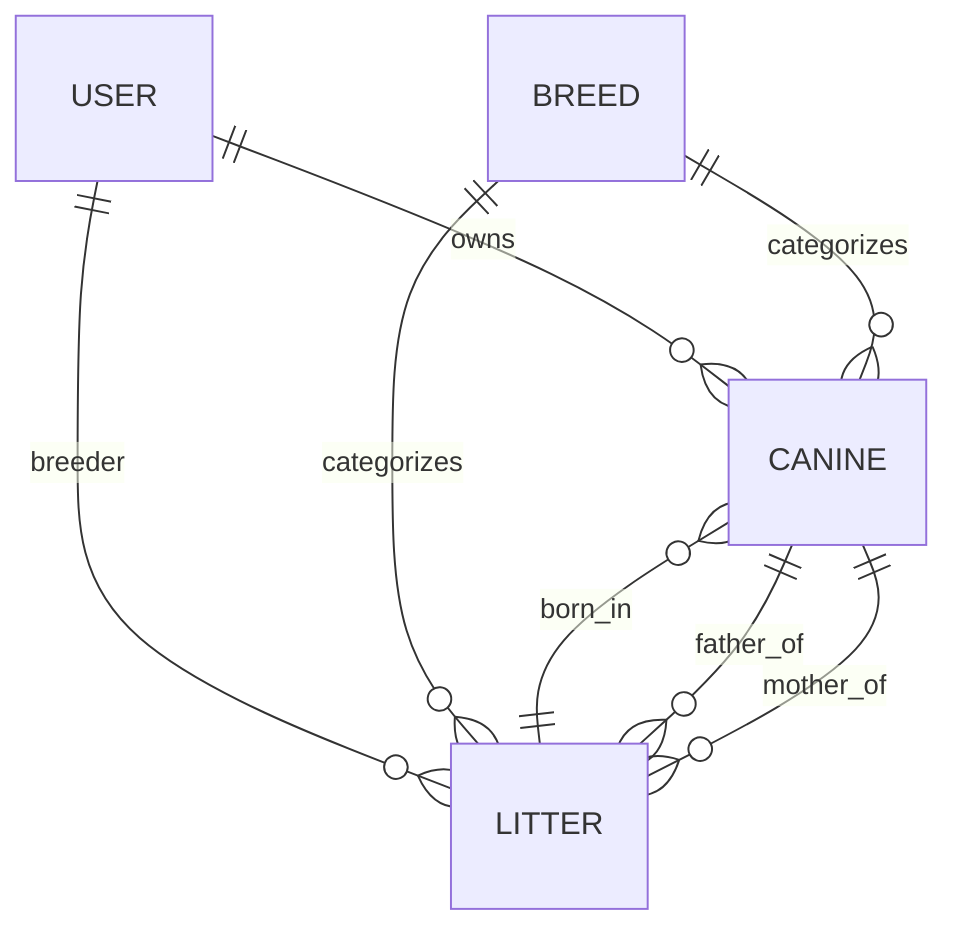

# Database Design Documentation

This project uses **Prisma ORM** with a modular schema design. Each business entity is defined in a separate `.prisma` file under `prisma/model/`.

## Core Entities

### User (`user.prisma`)
Represents the system users, including owners, breeders, and administrators.
- **Fields**: `id`, `email`, `role`, `name`, `profileImage`, `isVerified`.
- **Relations**: Has many `Canine`s and `Litter`s.

### Canine (`canine.prisma`)
The central entity for individual dog registrations.
- **Key Fields**:
    - `pcrId`: Unique registration ID (e.g., PCR-G301-00001).
    - `generation`: G1, G2, etc. (Generation tracking).
    - `tier`: BLUE or GOLD (Registry classification).
    - `name`, `gender`, `color`, `weight`.
    - `healthStatus`, `microchipId`.
- **Relations**:
    - `owner`: Linked to `User`.
    - `breed`: Linked to `Breed`.
    - `litter`: The birth litter.

### Litter (`litter.prisma`)
Manages the registration of multiple puppies born to the same parents.
- **Key Fields**: `pcrLitterId`, `dateOfBirth`, `totalPuppies`.
- **Relations**:
    - `mother` & `father`: References to `Canine`.
    - `puppies`: List of `Canine` records born in this litter.

### Breed (`Breed.prisma`)
Defines the canine breeds supported by the registry.
- **Fields**: `id`, `name`, `breedCode` (Numeric code for PCR IDs).

### PcrSequence (`canine.prisma`)
A helper table for atomic incremental ID generation for canines and litters.
- **Fields**: `kind`, `prefix`, `breedCode`, `lastValue`.

---

## Entity-Relationship Diagram (Mental Model)



## Prisma Setup
To update the schema, modify the files in `prisma/model/` and then run:
```bash
npx prisma generate
npx prisma db push
```
